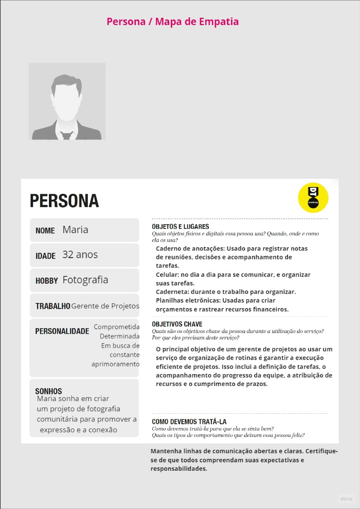
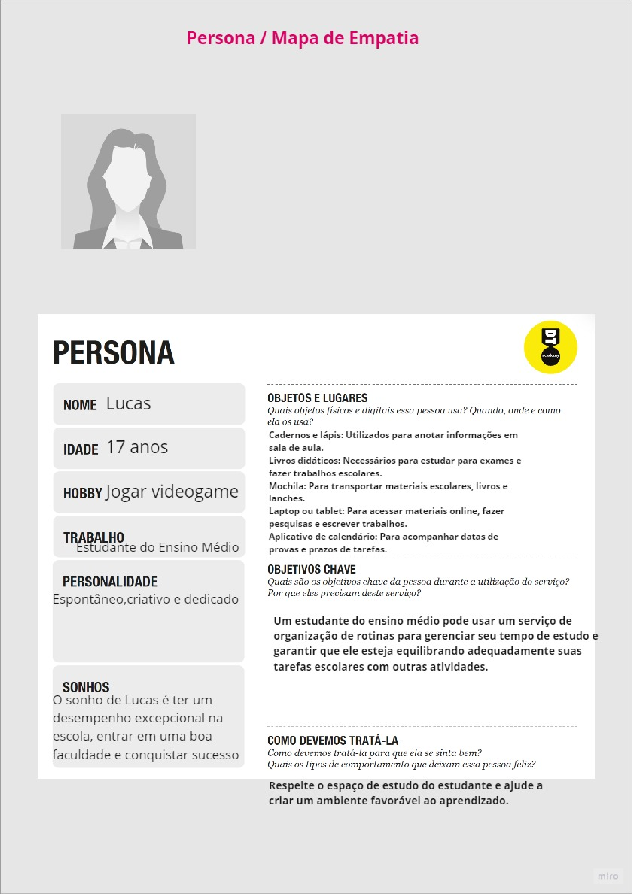
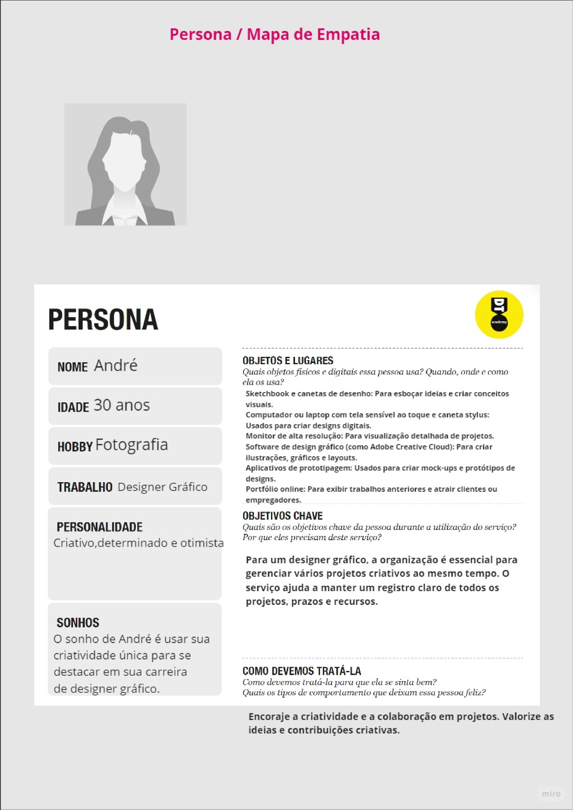
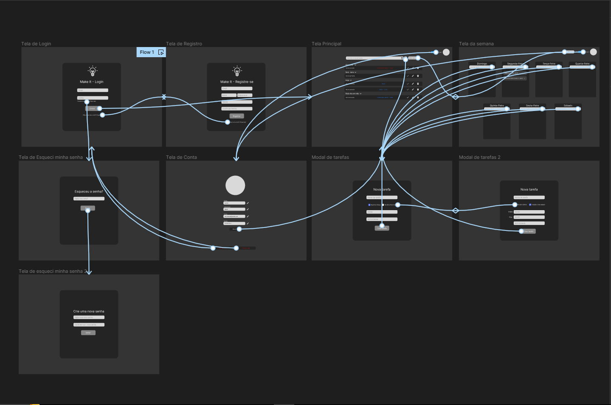

# Informações do Projeto
`TÍTULO DO PROJETO`  

**Make It**

`CURSO` 

 **Engenharia de Software**

## Participantes

> -  Arthur Nunes Gontijo de Barcellos
> -  Eduardo Castro Silva de Assis
> -  Gustavo Viana dos Santos
> -  João Francisco Rodrigues Abdanur Porto
> -  Matheus Arantes Coimbra
> -  Renan Mendes Vieira de Carvalho

# Estrutura do Documento

- [Informações do Projeto](#informações-do-projeto)
  - [Participantes](#participantes)
- [Estrutura do Documento](#estrutura-do-documento)
- [Introdução](#introdução)
  - [Problema](#problema)
  - [Objetivos](#objetivos)
  - [Justificativa](#justificativa)
  - [Público-Alvo](#público-alvo)
- [Especificações do Projeto](#especificações-do-projeto)
  - [Personas e Mapas de Empatia](#personas-e-mapas-de-empatia)
  - [Histórias de Usuários](#histórias-de-usuários)
  - [Requisitos](#requisitos)
    - [Requisitos Funcionais](#requisitos-funcionais)
    - [Requisitos não Funcionais](#requisitos-não-funcionais)
  - [Restrições](#restrições)
- [Projeto de Interface](#projeto-de-interface)
  - [User Flow](#user-flow)
  - [Wireframes](#wireframes)
- [Metodologia](#metodologia)
  - [Divisão de Papéis](#divisão-de-papéis)
  - [Ferramentas](#ferramentas)
  - [Controle de Versão](#controle-de-versão)
- [Projeto da Solução](#projeto-da-solução)
  - [Tecnologias Utilizadas](#tecnologias-utilizadas)
  - [Arquitetura da solução](#arquitetura-da-solução)
- [Avaliação da Aplicação](#avaliação-da-aplicação)
  - [Plano de Testes](#plano-de-testes)
  - [Ferramentas de Testes (Opcional)](#ferramentas-de-testes-opcional)
  - [Registros de Testes](#registros-de-testes)
- [Referências](#referências)

# Introdução
O projeto "Make It" é uma iniciativa criada por estudantes da PUC Minas, motivados pela observação de um desafio que afeta a vida cotidiana da população. No cenário agitado e multitarefado em que vivemos, muitas pessoas enfrentam a dificuldade de gerenciar suas rotinas devido às múltiplas tarefas e compromissos que se acumulam. Além disso, nosso projeto é sensível às necessidades das pessoas que, por diversos motivos, encontram dificuldades em organizar-se, como aqueles que lidam com o Transtorno de Déficit de Atenção e Hiperatividade (TDAH).

Para abordar esse desafio complexo, embarcamos em uma jornada de pesquisa que envolveu entrevistas, diálogos e escuta atenta das experiências e dificuldades das pessoas afetadas. Nosso objetivo foi ir além  do problema e compreender profundamente as dores e frustrações que enfrentam diariamente.

Durante esse processo, identificamos duas preocupações centrais que nortearam nosso projeto. Primeiramente, empenhamo-nos em criar um sistema intuitivo, projetado para ser acessível a todas as faixas etárias. Reconhecemos que a simplicidade e a facilidade de uso são fundamentais para garantir que nosso sistema seja adotado por uma ampla gama de pessoas.

Em segundo lugar, focamos em desenvolver um sistema que não apenas simplificasse a organização, mas também aumentasse a produtividade e proporcionasse uma sensação tangível de controle sobre as obrigações diárias. O estresse cotidiano de não conseguir realizar tarefas é uma realidade que desejamos eliminar.

Neste documento, exploraremos em detalhes o processo de desenvolvimento do projeto "Make It". Abordaremos a pesquisa realizada, o design do sistema e as estratégias implementadas para alcançar nossos objetivos. Além disso, apresentaremos as funcionalidades do sistema e os benefícios esperados para os usuários.
 
Ao compartilhar nossa jornada, aspiramos a contribuir significativamente para a melhoria da qualidade de vida das pessoas, tornando suas rotinas mais gerenciáveis e gratificantes. 

## Problema

  O problema que nosso grupo busca resolver é a desorganização dos horários e da rotina do dia a dia. Atualmente muitas pessoas mantém uma rotina, seja igual durante toda a semana ou com leves mudanças em dias específicos, porém seja por falta de atenção, atraso entre várias outras dificuldades é comum que esqueçam de fazer uma coisa ou outra. Além de pessoas com memórias ruins ou apresentam dificuldades com atenção, podem acabar distraindo e esquecendo coisas importantes, como arrumar a mochila, escovar os dentes, etc.
  Também busca ajudar aqueles que tem dificuldades para organizarem seus horários, como o horário de estudo, de academia, entre outros. E montando uma rotina com base nas atividades do usuário para que não tenha que se preocupar com esquecer de fazer algo e muito menos de perder uma de suas atividades por acidente, como dormir de mais.
  
## Objetivos

 Objetivo Geral:
 - Desenvolver um software para auxiliar pessoas a se organizar diariamente.

 Objetivo Especificos:
 - Esquematizar eventos na rotina.
 - Propor melhor visualização de tarefas.
 - Auxiliar na priorização de atividades e otimização da rotina.
 - Identificar atividades rotineiras e auxiliar em eventos inusitados.

## Justificativa

  A falta de organização é um problema comum e diário na vida da maioria das pessoas, abrangendo todas as faixas etárias, desde adolescentes até adultos com anos de experiência. No entanto, com a rápida evolução e o cada vez maior acesso à tecnologia disponível, novas formas de abordar esse problema estão sendo desenvolvidas. Este projeto de engenharia de software é motivado para criar artefatos que possam ajudar essas pessoas a serem mais prudentes com seus horários e responsabilidades. Além disso, esse projeto pode ajudar os usuários a terem um maior contentamento pessoal e profissional devido ao menor estresse e insegurança sobre suas tarefas.

## Público-Alvo

  Pessoas entre 17 e 50 anos que, por possuírem dificuldade em gerir sua rotina, desejam uma ferramenta para ajudar na organização dela. Moram em zonas urbanas e possuem aparelhos digitais com conexão à internet, onde desejam checar e atualizar suas rotinas. Porém, têm dificuldade em como montar seu planejamento e muitas vezes carecem de um artefato de fácil acesso e modularidade.
 
# Especificações do Projeto

Iremos apresentar as técnicas e ferramentas utilizadas para realizar as especificações do
projeto, além dos processos utilizados para chegarmos ao produto que irá solucionar nosso problema

## Personas e Mapas de Empatia

## Histórias de Usuários

Com base na análise das personas forma identificadas as seguintes histórias de usuários:

|EU COMO... `PERSONA`| QUERO/PRECISO ... `FUNCIONALIDADE`              |PARA ... `MOTIVO/VALOR`                                               |
|--------------------|-------------------------------------------------|----------------------------------------------------------------------|
|Maria               | Criar, atribuir tarefas e gerenciar prazos      | Execução eficiente de projetos e alinhamento da equipe               |
|Lucas               | Agendar estudos, rastrear datas de provas       | Equilibrar estudos e melhorar desempenho acadêmico                   |
|André               | Organizar projetos, acompanhar prazos           | Gerenciar projetos criativos e manter a criatividade                 |
|Sofia               | Agendar plantões, registrar informações médicas | Gestão eficiente do tempo e cuidados médicos                         |
|Emily               | Rastrear inventário, coordenar marketing        | Controle de estoque e crescimento do negócio online                  |
|João                | Agendar aulas, acompanhar progresso             | Oferecer aulas eficazes e manter registros de alunos                 |

## Requisitos

As tabelas que se seguem apresentam os requisitos funcionais e não funcionais que detalham o escopo do projeto.

### Requisitos Funcionais

|ID    | Descrição do Requisito  | Prioridade |
|------|-----------------------------------------|----|
|RF-001| Permitir que o usuário cadastre tarefas | ALTA | 
|RF-002| Permitir que o usuário cadastre tarefas rápidas  | MÉDIA |
|RF-003| Drag de tarefas | MÉDIA |
|RF-004| Alteração de dados do usuário | MÉDIA |
|RF-005| Tarafas com horários | ALTA |
|RF-006| Tarefas com datas | ALTA |
|RF-007| Imagem de perfil | BAIXA |
|RF-008| Interface que renderiza todas as tarefas | ALTA
|RF-009| Interface que renderiza as tarefas semanais | MÉDIA
|RF-010| O site deve possuir um tema claro e tema escuro | BAIXA

### Requisitos não Funcionais

|ID     | Descrição do Requisito  |Prioridade |
|-------|-------------------------|----|
|RNF-001| O sistema deve ser responsivo para rodar em um dispositivos móvel | MÉDIA | 
|RNF-002| O site deve estar disponível 24 horas por dia |  ALTA | 
|RFN-003| O site de ver publicado na internet | ALTA |
|RFN-004| O site deve possuir uma interface fácil e intuitiva | MÉDIA |
|RFN-005| Paleta de cores minimalista com tonalidades escuras e outra paleta com tonalidades brancas | MÉDIA |

## Restrições

O projeto está restrito pelos itens apresentados na tabela a seguir.

|ID| Restrição                                             |
|--|-------------------------------------------------------|
|01| O projeto deverá ser entregue até o final do semestre |
|02| Não pode ser desenvolvido um módulo de backend        |
|03| Deve ser um site |
|04| Projeto deve utilizar apenas tecnologias front-end |
|05| O site não aceitará contas com email idêntico |
|06| O site só poderá ser utilizado se houver um cadastro |

# Projeto de Interface

A seguir, será apresentado o desenvolvimento do **User Flow** e **Wireframe** do Make It.

## User Flow

## Wireframes

> ### Wireframes do projeto Make It
>
> **Tela de Login**
>
> 
>
> **Tela de Registro**
>
> 
>
> **Tela Principal**
>
> 
>
> **Tela Semanal**
>
> 
>
> **Tela de Conta** 
>
> 
>
> **Esqueci minha senha**
>
> 
>
> 
>
> **Modal de tarefas**
>
> 
>
> 

# Metodologia

Nesta seção, apresentaremos a metodologia adotada pelo nosso grupo, descrevendo o processo de trabalho com base nas metodologias ágeis, a divisão de papéis e tarefas, as ferramentas utilizadas e como realizamos a gestão de configuração do projeto via GitHub.

## Metodologia Ágil

Para o desenvolvimento do projeto, optamos por adotar uma abordagem ágil. Isso significa que nosso trabalho foi baseado em princípios ágeis, como colaboração, adaptação a mudanças e entregas incrementais. Utilizamos o Framework Scrum para guiar nossos processos, e a seguir detalhamos como isso foi implementado.

Além disso, no início do projeto, empregamos o processo de Design Thinking para garantir que compreendêssemos completamente as necessidades dos usuários e que nossa solução fosse centrada no usuário. Realizamos uma matriz CSD (Causa-Solução-Diferenciação) para analisar problemas e oportunidades, mapeamos nossos stakeholders para entender suas perspectivas, conduzimos entrevistas qualitativas para obter insights valiosos, criamos personas para representar nosso público-alvo, realizamos sessões de brainstorming para gerar ideias criativas, usamos um mural de possibilidades para visualizar conceitos e finalmente, um mapa de priorização para determinar quais funcionalidades eram mais cruciais para os usuários.

## Divisão de Papéis

| Nome   | Função    |
|-----------|------|
| Arthur Nunes | Product Owner (PO) / Engenheiro de Software
| Eduardo Castro | Engenheiro de Software
| Gustavo Viana | Analista de Usuabilidade / Engenheiro de Software
| João Francisco | Engenheiro de Software
| Matheus Arantes | UI Designer / Engenheiro de Software
| Renan Mendes | Scrum Master / Engenheiro de Software

## Ferramentas

| Ambiente  | Plataforma              |Link de Acesso |
|-----------|-------------------------|---------------|
|Processo de Design Thinkgin  | Miro |  [Miro](https://miro.com/welcomeonboard/RHZVeVFVRjh6NGFLU2Ftd0h2SlBDMm42UmZ3U1cyYzNFZGc3NThJTHhORGp5bnRwcEo4TWJzNHgyNkpERWI2M3wzNDU4NzY0NTY0MTEwMzAxNDgzfDI=?share_link_id=870368505080) | 
|Repositório de código | GitHub | [Repositório](https://github.com/ICEI-PUC-Minas-PMGES-TI/pmg-es-2023-2-ti1-2010100-organizador-de-rotinas) | 
|Hospedagem do site | Vercel |  https://vercel.com | 
|Protótipo Interativo | Figma | [Figma](https://www.figma.com/file/SBNmpz6reivx1NtJKXopyG/Make-It?type=design&node-id=0%3A1&mode=design&t=vngpKJzNhvP2Wvd0-1) | 

> As ferramentas empregadas no projeto são:
> 
> - Editor de código (IDE): Visual Studio Code
> - Ferramentas de comunicação: Discord e WhatsApp
> - Ferramentas de diagramação: Figma e Miro
> - Plataforma de hospedagem: Vercel

O Visual Studio Code foi escolhido porque ele possui uma integração com o
Git de uma maneira bem otimizada, além de, possuir ótimas extensões/plugins aumentando a performance e produtividade.
As ferramentas de comunicação: Discord e WhatsApp são comumente
usadas, tornado simples e fácil reuniões e demais discussões. Por fim, para criar
diagramas, utilizamos Miro e Figma devido as suas diversas ferramentas, configurações e sua facilidade
para desenvolver o trabalho em equipe.

## Controle de Versão

> A ferramenta de controle de versão adotada no projeto foi o
> [Git](https://git-scm.com/), sendo que o [Github](https://github.com)
> foi utilizado para hospedagem do repositório `upstream`.
> 
> O projeto segue a seguinte convenção para o nome de branchs:
> 
> - `main`: versão estável já testada do software
> - `testing`: versão em testes do software
> - `dev`: versão de desenvolvimento do software
> 
> Quanto à gerência de issues, o projeto adota a seguinte convenção para
> etiquetas:
> 
> - `bugfix`: uma funcionalidade encontra-se com problemas
> - `feature`: uma nova funcionalidade precisa ser introduzida

# Projeto da Solução

......  COLOQUE AQUI O SEU TEXTO ......

## Tecnologias Utilizadas

......  COLOQUE AQUI O SEU TEXTO ......

> Descreva aqui qual(is) tecnologias você vai usar para resolver o seu
> problema, ou seja, implementar a sua solução. Liste todas as
> tecnologias envolvidas, linguagens a serem utilizadas, serviços web,
> frameworks, bibliotecas, IDEs de desenvolvimento, e ferramentas.
> Apresente também uma figura explicando como as tecnologias estão
> relacionadas ou como uma interação do usuário com o sistema vai ser
> conduzida, por onde ela passa até retornar uma resposta ao usuário.
> 
> Inclua os diagramas de User Flow, esboços criados pelo grupo
> (stoyboards), além dos protótipos de telas (wireframes). Descreva cada
> item textualmente comentando e complementando o que está apresentado
> nas imagens.

## Arquitetura da solução

......  COLOQUE AQUI O SEU TEXTO E O DIAGRAMA DE ARQUITETURA .......

> Inclua um diagrama da solução e descreva os módulos e as tecnologias
> que fazem parte da solução. Discorra sobre o diagrama.
> 
> **Exemplo do diagrama de Arquitetura**:
> 
> 

# Avaliação da Aplicação

......  COLOQUE AQUI O SEU TEXTO ......

> Apresente os cenários de testes utilizados na realização dos testes da
> sua aplicação. Escolha cenários de testes que demonstrem os requisitos
> sendo satisfeitos.

## Plano de Testes

......  COLOQUE AQUI O SEU TEXTO ......

> Enumere quais cenários de testes foram selecionados para teste. Neste
> tópico o grupo deve detalhar quais funcionalidades avaliadas, o grupo
> de usuários que foi escolhido para participar do teste e as
> ferramentas utilizadas.
> 
> **Links Úteis**:
> - [IBM - Criação e Geração de Planos de Teste](https://www.ibm.com/developerworks/br/local/rational/criacao_geracao_planos_testes_software/index.html)
> - [Práticas e Técnicas de Testes Ágeis](http://assiste.serpro.gov.br/serproagil/Apresenta/slides.pdf)
> -  [Teste de Software: Conceitos e tipos de testes](https://blog.onedaytesting.com.br/teste-de-software/)

## Ferramentas de Testes (Opcional)

......  COLOQUE AQUI O SEU TEXTO ......

> Comente sobre as ferramentas de testes utilizadas.
> 
> **Links Úteis**:
> - [Ferramentas de Test para Java Script](https://geekflare.com/javascript-unit-testing/)
> - [UX Tools](https://uxdesign.cc/ux-user-research-and-user-testing-tools-2d339d379dc7)

## Registros de Testes

......  COLOQUE AQUI O SEU TEXTO ......

> Discorra sobre os resultados do teste. Ressaltando pontos fortes e
> fracos identificados na solução. Comente como o grupo pretende atacar
> esses pontos nas próximas iterações. Apresente as falhas detectadas e
> as melhorias geradas a partir dos resultados obtidos nos testes.

# Referências

Brotto, Thaiana. Você sabe qual é a importância de manter uma rotina? Psitto, 2020. Disponível em:
https://www.psitto.com.br/blog/voce-sabe-qual-e-a-importancia-de-manter-uma-rotina/ . Acesso em:
08/04/2023.

TotalPass, Marketing. Rotina: porque é importante manter uma. Totalpass, 2021. Disponível em:
https://blog.totalpass.com.br/bem-estar/rotina-porque-e-importante-manter-uma/ . Acesso em
08/04/2023.

Franco, Amanda. Rotina e Saúde Mental: 7 dicas práticas para se organizar. Eurekka, 2022. Disponível em:
https://blog.eurekka.me/rotina-e-saude-mental/ . Acesso em 08/04/2023.

Por quê é tão difícil se manter organizado? Olivaorganizer, 2016. Disponível em:
https://www.olivaorganizer.com.br/por-que-e-tao-dificil-se-manter-organizado/ . Acesso em 08/04/2023.

Como organizar a rotina diária e equilibrar trabalho e descanso? Direcional, 2021. Disponível em:
https://direcional.com.br/blog/estilo-de-vida/organizar-rotinadiaria/#:~:text=Muito%20mais%20do%20que%20deixar,dia%2C%20tranquilidade%2C%20entre%20outras
. Acesso em 08/04/2023
